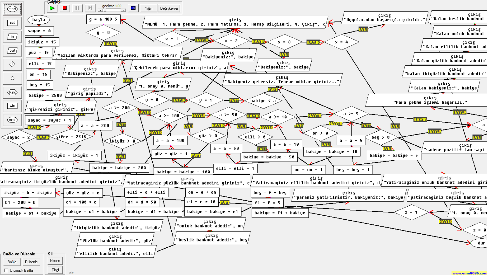

# ATM Simulation Project (Flowchart)

This project is a comprehensive simulation of an Automated Teller Machine (ATM) system logic, designed and visualized using flowchart diagrams. It demonstrates the algorithmic thinking behind banking transactions, including secure authentication, balance management, and optimal banknote distribution.

## 🚀 Features

The simulation covers all core functionalities of a real-world ATM:

* **🔐 Secure Authentication System:**
    * Requires a 4-digit PIN for access (Default: `2518`).
    * Includes a security lockout mechanism that blocks the card after **3 incorrect attempts**.

* **💰 Smart Withdrawal Algorithm (Greedy Approach):**
    * Calculates the most efficient way to dispense cash using available banknotes.
    * Prioritizes larger denominations (200, 100, 50, 10, 5 TL) to minimize the number of bills given.
    * Checks for sufficient balance and banknote availability before dispensing.

* **➕ Detailed Deposit System:**
    * Allows users to deposit specific counts of different banknotes (e.g., "3 pieces of 200 TL").
    * Automatically updates the total balance and the internal stock of each banknote type.

* **📊 Dynamic Menu & Balance Tracking:**
    * User-friendly menu interface (Withdraw, Deposit, Account Info, Exit).
    * Real-time balance updates after every transaction.

## 🧠 Algorithmic Logic

This project implements structured programming concepts:
* **Loops:** For authentication retries and menu navigation.
* **Conditionals (If-Else):** For password validation and balance checks.
* **Mathematical Operations:** For calculating the remaining balance and banknote distribution (Modulus & Division logic).

## 🛠️ How to Run

1.  **Clone or Download** this repository.
2.  Ensure you have a flowchart interpreter installed (e.g., **Flowgorithm**).
3.  Open the `Bankamatik.fpp` file.
4.  Click the **Run** (Play) button to start the simulation.

## 📬 Contact

If you have any questions or suggestions about this project, feel free to reach out:

* **Developer:** Selim Efe
* **LinkedIn:** [Selim Efe on LinkedIn](https://www.linkedin.com/in/selim-efe-u-704b70335)

---
*This project was created for educational purposes to demonstrate algorithm design skills.*
